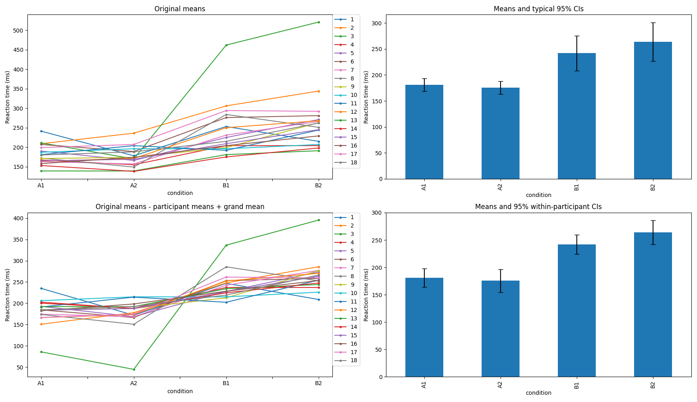

# `cmci.py`

Cousineau-Morey confidence intervals ([Morey 2008](https://web.archive.org/web/20180720084728id_/http://www.tqmp.org/Content/vol04-2/p061/p061.pdf)) calculated with a Python implementation. Based on Jarrod Blinch's [2014 blog tutorial](https://motorbehaviour.wordpress.com/2014/10/31/confidence-intervals-in-within-participant-design-a-tutorial-on-the-cousineau-morey-method/),
I coded this Python implementation to aid my own learning on the topic. Thank you Jarrod; your tutorial helped me a lot.

## Usage

`python3 cmci.py` runs the script, outputs all values calculated using the sample data, and shows four plots.

`python3 cmci.py --datafile=/path/to/your/datafile.tsv` runs the script using _your_ data. It assumes the data layout in the format of the table in the [blog entry](https://motorbehaviour.wordpress.com/2014/10/31/confidence-intervals-in-within-participant-design-a-tutorial-on-the-cousineau-morey-method/).

`python3 cmci.py --datafile=/path/to/your/datafile.tsv --ylabel="My quantitative measurement"` allows you to specify the `y` axis label.

## Installation

Requires `pandas`, `matplotlib`, and `scipy`. A pip [`requirements.txt`](requirements.txt) file is included, so you can install by running:

```bash
python3 -m pip install -r requirements.txt
```

## Default output

It outputs plots similar to those from the blog tutorial:



And dumps a the calculations and results to `stdout`:

```

Example dataset from the tutorial:
     A1   A2   B1   B2  participant_mean
1   241  178  253  215            221.75
2   209  236  306  344            273.75
3   211  170  462  521            341.00
4   167  155  204  204            182.50
5   190  166  225  271            213.00
6   207  189  276  281            238.25
7   163  157  231  266            204.25
8   172  149  284  251            214.00
9   171  174  199  263            201.75
10  187  196  196  207            196.50
11  181  204  192  244            205.25
12  164  171  250  268            213.25
13  139  139  181  191            162.50
14  153  138  175  198            166.00
15  165  169  209  245            197.00
16  158  174  204  229            191.25
17  199  207  294  292            248.00
18  180  188  215  262            211.25

          A1      A2      B1      B2  participant_mean
mean  180.94  175.56  242.00  264.00            215.62
std    25.12   24.99   67.78   74.63             41.19

n = 18
tα/2 = 2.1098155778331806
grand_mean = 215.625
sd = 41.19378968756734
sqrt_n = 4.242640687119285
ci = 20.485189673657093

95% confidence intervals for the grand mean using the typical formula: 
CI = Mean +/- t(1-alpha/2, n-1) * SD / sqrt(n)
[195.1398103263429, 236.1101896736571]

Typical 95% CI pairs for each condition:
A1: [168.45390178496396, 193.43498710392495]
A2: [163.12601352874694, 187.98509758236415]
B1: [208.29470158878615, 275.70529841121385]
B2: [226.88694831043975, 301.1130516895603]

          mean        std  typical_ci
A1  180.944444  25.117306   12.490543
A2  175.555556  24.994640   12.429542
B1  242.000000  67.778185   33.705298
B2  264.000000  74.630856   37.113052

"Now the fun begins."

Normalized data before adding the grand mean (215.625):
        A1      A2      B1      B2
1    19.25  -43.75   31.25   -6.75
2   -64.75  -37.75   32.25   70.25
3  -130.00 -171.00  121.00  180.00
4   -15.50  -27.50   21.50   21.50
5   -23.00  -47.00   12.00   58.00
6   -31.25  -49.25   37.75   42.75
7   -41.25  -47.25   26.75   61.75
8   -42.00  -65.00   70.00   37.00
9   -30.75  -27.75   -2.75   61.25
10   -9.50   -0.50   -0.50   10.50
11  -24.25   -1.25  -13.25   38.75
12  -49.25  -42.25   36.75   54.75
13  -23.50  -23.50   18.50   28.50
14  -13.00  -28.00    9.00   32.00
15  -32.00  -28.00   12.00   48.00
16  -33.25  -17.25   12.75   37.75
17  -49.00  -41.00   46.00   44.00
18  -31.25  -23.25    3.75   50.75

Normalized data after adding the grand mean (215.625):
         A1       A2       B1       B2
1   234.875  171.875  246.875  208.875
2   150.875  177.875  247.875  285.875
3    85.625   44.625  336.625  395.625
4   200.125  188.125  237.125  237.125
5   192.625  168.625  227.625  273.625
6   184.375  166.375  253.375  258.375
7   174.375  168.375  242.375  277.375
8   173.625  150.625  285.625  252.625
9   184.875  187.875  212.875  276.875
10  206.125  215.125  215.125  226.125
11  191.375  214.375  202.375  254.375
12  166.375  173.375  252.375  270.375
13  192.125  192.125  234.125  244.125
14  202.625  187.625  224.625  247.625
15  183.625  187.625  227.625  263.625
16  182.375  198.375  228.375  253.375
17  166.625  174.625  261.625  259.625
18  184.375  192.375  219.375  266.375

          A1      A2      B1      B2
mean  180.94  175.56  242.00  264.00
std    30.00   36.56   30.85   37.99

c = 4
morey = 1.1547005383792515

A1: [163.71619727243925, 198.17269161644967]
A2: [154.56120355472478, 196.5499075563863]
B1: [224.28671109412343, 259.71328890587654]
B2: [242.1868848793678, 285.81311512063223]

      mean    std  cm_ci
A1  180.94  30.00  17.23
A2  175.56  36.56  20.99
B1  242.00  30.85  17.71
B2  264.00  37.99  21.81

Normalized data for A and B means:
          A        B
1   203.375  227.875
2   164.375  266.875
3    65.125  366.125
4   194.125  237.125
5   180.625  250.625
6   175.375  255.875
7   171.375  259.875
8   162.125  269.125
9   186.375  244.875
10  210.625  220.625
11  202.875  228.375
12  169.875  261.375
13  192.125  239.125
14  195.125  236.125
15  185.625  245.625
16  190.375  240.875
17  170.625  260.625
18  188.375  242.875

          A      B
mean  178.0  253.0
std    31.0   31.0

Calculate confidence interval for A and B means:
c = 2
morey = 1.4142135623730951

A: [156.12582733953462, 200.37417266046538]
B: [230.87582733953462, 275.1241726604654]

     mean    std  mc_ci
A  178.25  31.46  22.12
B  253.00  31.46  22.12
Done.

```

## Author

Link Swanson